  

  

  
  
  
  

  

---

<h2 align="center">Featured project</h2>

<table>
<tr>
<td width="100%" valign="top">

<h3>
  <a href="https://github.com/Bad33/policyproof">🔎 PolicyProof</a>
</h3>

An evaluation-first RAG system that checks whether answers about AI governance are supported by reliable evidence and precise citations.

The project includes reproducible document processing, lexical and dense retrieval evaluation, source-provenance tracking, evidence-sufficiency assessment, citation verification, and abstention handling.

  <code>Python</code>
  <code>RAG</code>
  <code>Dense Retrieval</code>
  <code>BM25</code>
  <code>Evaluation</code>
  <code>AI Governance</code>

</td>
</tr>
</table>

---

<h2 align="center">Technology</h2>

  

  <code>RAG</code>
  <code>Machine Learning</code>
  <code>REST APIs</code>
  <code>System Design</code>
  <code>Full-Stack Development</code>

---

<h2 align="center">Research</h2>

* **AML mortality prediction using clinical and genomic features**
  Developed machine-learning approaches for predicting mortality outcomes in patients with acute myeloid leukemia.
  *Blood, 2025*

* **Geographic equity in gastrointestinal cancer clinical-trial access**
  Studied geographic disparities and accessibility barriers affecting participation in gastrointestinal cancer clinical trials.
  *Journal of Clinical Oncology, 2026*

* **Pacritinib safety-signal analysis using FAERS**
  Evaluated real-world adverse-event reports to identify potential safety signals associated with pacritinib.
  *Clinical Lymphoma, Myeloma and Leukemia, 2025*

* **Asciminib safety-signal analysis using FAERS**
  Analyzed post-marketing pharmacovigilance data to investigate reported adverse events and potential safety signals associated with asciminib.
  *Clinical Lymphoma, Myeloma and Leukemia, 2025*

  

---

<h2 align="center">GitHub activity</h2>

  

  

  

